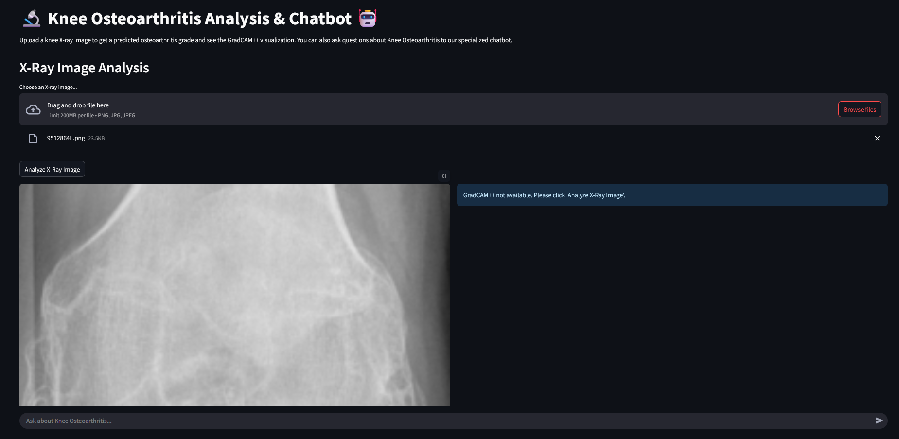

# 🔬 Knee Osteoarthritis Grading and Chatbot Assistant



This project provides a comprehensive system for analyzing knee osteoarthritis (KOA) from X-ray images. It combines a deep learning model for classification with GradCAM++ for visual explanations, and integrates a RAG-powered chatbot to answer questions about the condition.

## ✨ Features

- **🤖 AI-Powered Classification**: Uses a ResNet-18 model to classify knee X-rays into 5 grades (0-4) of osteoarthritis.
- **👁️ Explainable AI (XAI)**: Generates GradCAM++ heatmaps to visualize which parts of the X-ray the model focused on for its prediction.
- **💬 RAG Chatbot**: An intelligent chatbot, powered by LangChain and Ollama (Llama 3.1), that answers user questions about KOA based on a provided knowledge base.
- **🖥️ Interactive Web UI**: A user-friendly interface built with Streamlit for easy interaction.

## 🛠️ System Architecture

The system is composed of two main parts:

1.  **Image Analysis Pipeline**: The user uploads an X-ray. The Streamlit app sends it to the fine-tuned PyTorch (ResNet-18) model for grade prediction. GradCAM++ is then used on the model's final convolutional layer to generate a visual explanation.
2.  **RAG Chatbot Pipeline**: The user asks a question. LangChain retrieves relevant information from a pre-built ChromaDB vector store (containing medical texts about KOA). The retrieved context and the user's question are passed to an Ollama-hosted LLM to generate an informed answer.

## 🚀 Setup and Installation

Follow these steps to set up and run the project locally.

### 1. Prerequisites

- Python 3.9+
- [Ollama](https://ollama.com/): Make sure Ollama is installed and running.

### 2. Clone the Repository

```bash
git clone https://github.com/YOUR_USERNAME/knee-osteoarthritis-analyzer.git
cd knee-osteoarthritis-analyzer
```

### 3. Set Up a Virtual Environment

```bash
# For Windows
python -m venv venv
venv\Scripts\activate

# For macOS/Linux
python3 -m venv venv
source venv/bin/activate
```

### 4. Install Dependencies

```bash
pip install -r requirements.txt
```

### 5. Download LLM and Embedding Models

Pull the necessary models using Ollama.

```bash
ollama pull llama3:8b        # or llama3.1:8b-instruct
ollama pull nomic-embed-text
```

### 6. Prepare Context for Chatbot

Place your `.txt` files containing information about Knee Osteoarthritis into the `db/` directory.

## 🏃‍♀️ Running the Application

**Important**: Run these steps in order.

### 1. (Optional) Train Your Own Model

To train the classification model from scratch, you need the [Knee Osteoarthritis Dataset from Kaggle](https://www.kaggle.com/datasets/shreystechs/knee-osteoarthritis-dataset-with-severity).

- Download and extract the dataset.
- Organize it into `train`, `val`, and `test` folders as expected by `train.py`.
- Run the training script:
  ```bash
  python train.py
  ```
  This will save a `best_model.pth` in the `models/` directory.

### 2. Create the Vector Database

This step is mandatory for the chatbot to work. It reads the files from `db/`, creates embeddings, and saves them to a local vector store.

```bash
python llm.py
```

### 3. Launch the Streamlit App

Now you are ready to start the main application.

```bash
streamlit run app.py
```

Open your web browser and navigate to the local URL provided by Streamlit (usually `http://localhost:8501`).

## 📁 File Descriptions

- `app.py`: The main Streamlit web application.
- `train.py`: Script for training the ResNet-18 model.
- `llm.py`: Script to set up the ChromaDB vector store for the RAG chatbot.
- `gradcam.py`: A standalone script for testing GradCAM generation.
- `requirements.txt`: A list of all Python dependencies.
- `db/`: Folder to store text files for the chatbot's knowledge base.
- `models/`: Folder to store the trained model weights.
